# shreg - Shape Regularization

A Python implementation of various shape regularization algorithms for regularizing line segments and closed contours.

Shape regularization is a technique used in computational geometry to clean up noisy or imprecise geometric data by aligning segments to common orientations and adjusting their positions to create cleaner, more regular shapes.

## Features

- **Segment Regularization**: Align line segments to common angles and offsets using quadratic programming optimization
- **Snap Regularization**: Connect nearby endpoints to create watertight polygons and meshes
- **Metric Regularization**: Constrain segment dimensions - equal lengths, length quantization, and equal spacing
- **Contour Regularization**: Simplify closed polygons by aligning edges to principal directions
- **T-Junction Detection**: Snap endpoints onto segment interiors for proper connectivity
- **Flexible Configuration**: Control maximum angle and offset tolerances
- **Visualization**: Built-in plotting utilities for before/after comparisons
- **Pure Python**: No dependencies required

## Installation

### Using pip

```bash
pip install shreg
```

### Using uv

```bash
uv pip install shreg
```

### From source

```bash
git clone https://github.com/nickp/shreg.git
cd shreg
pip install -e .
```

## Quick Start

### Segment Regularization

Regularize a set of line segments by aligning their angles and offsets:

```python
import numpy as np
from shreg import solve_line_segments, seg

# Create some segments (each segment is [x1, y1, x2, y2])
segments = [
    seg(0.0, 0.0, 1.0, 0.02),   # Nearly horizontal
    seg(0.0, 1.0, 1.0, 1.05),   # Nearly horizontal, slightly offset
    seg(1.0, 0.0, 1.02, 1.0),   # Nearly vertical
]

# Regularize: align angles within 25 degrees, offsets within 0.5 units
result = solve_line_segments(
    segments,
    angle=True,
    offset=True,
    maximum_angle=25,
    maximum_offset=0.5
)
```

### Contour Regularization

Simplify a closed polygon by aligning edges to principal directions:

```python
from shreg import regularize_contour

# Define a noisy polygon (list of [x, y] points)
points = [
    [45, 29], [65, 440], [44, 498], [446, 498], [429, 325],
    [499, 309], [448, 206], [479, 148], [479, 31], [247, 88],
]

# Regularize with axis alignment
result = regularize_contour(
    points,
    principle="axis",     # Align to horizontal/vertical
    max_offset=20,        # Maximum offset for merging
)

print(f"Simplified from {len(points)} to {len(result)} points")
```

### Snap Regularization

Close gaps between nearby endpoints to create watertight polygons:

```python
from shreg import snap_regularize_segments, seg

# Create segments with small gaps at corners
segments = [
    seg(0.0, 0.0, 1.0, 0.0),    # bottom edge
    seg(1.05, 0.02, 1.0, 1.0),  # right edge (gap at bottom-right)
    seg(1.0, 1.03, 0.0, 0.98),  # top edge (gap at corners)
    seg(-0.02, 1.0, 0.0, 0.0),  # left edge (gap at top-left)
]

# Snap endpoints within 0.1 units of each other
result = snap_regularize_segments(
    segments,
    epsilon=0.1,      # Distance threshold for snapping
    method="cluster"  # Fast centroid-based method
)
# Result: All corners are now perfectly connected
```

### Metric Regularization

Constrain segment dimensions - force equal lengths, quantize to grid units, or equalize spacing:

```python
from shreg import metric_regularize_segments, seg

# Segments with slightly different lengths and uneven spacing
segments = [
    seg(0.0, 0.0, 1.9, 0.0),   # length ~2
    seg(0.0, 0.9, 2.1, 0.9),   # length ~2, y=0.9 (should be 1.0)
    seg(0.0, 2.0, 1.95, 2.0),  # length ~2
]

# Regularize: equal lengths, snap to 1-unit grid, equalize spacing
result = metric_regularize_segments(
    segments,
    equal_length=True,         # Force similar lengths to be equal
    length_quantization=True,  # Snap lengths to multiples of base_unit
    equal_spacing=True,        # Equalize gaps between parallel lines
    base_unit=1.0,             # Grid unit for quantization
)
# Result: All segments have length 2.0 and are evenly spaced at y=0, 1, 2
```

## Examples

### Segment Regularization

The algorithm optimizes segment orientations and positions to create cleaner line arrangements:

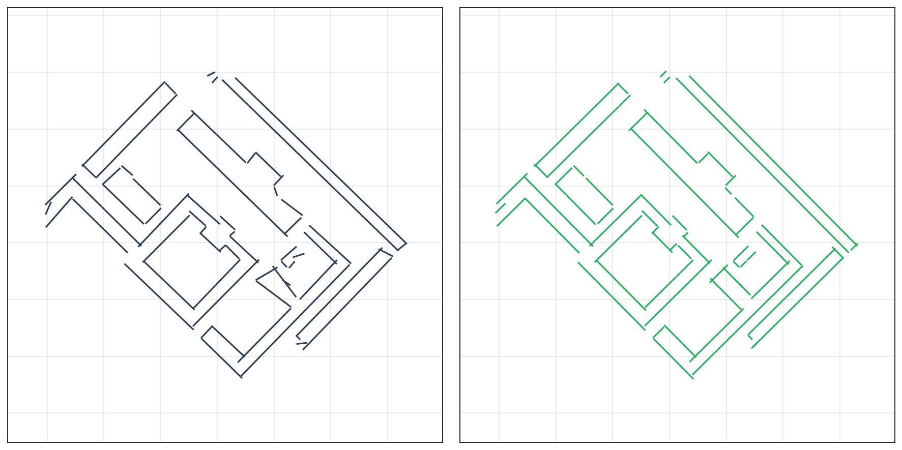

Angle regularization aligns crossing lines to common orientations:

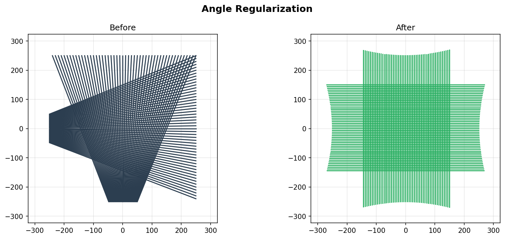

Combined angle and offset regularization on a hexagon:

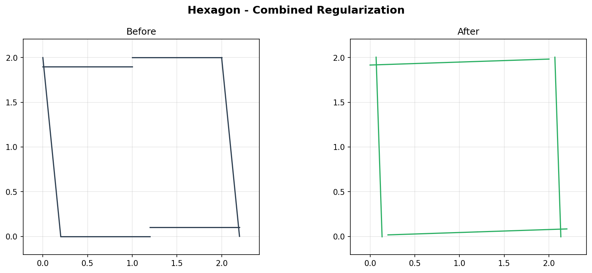

#### Angle + Offset Regularization with Groups

This example from the [CGAL documentation](https://doc.cgal.org/latest/Shape_regularization/index.html#title10) demonstrates sequential angle and offset regularization on 15 segments organized into three groups: outer boundary, top rhombus, and bottom rhombus.

```python
from shreg import solve_line_segments, create_cgal_example

# Load the 15 segments from the CGAL example
segments, groups = create_cgal_example()

# Regularize with tight tolerances
result = solve_line_segments(
    segments,
    angle=True,
    offset=True,
    maximum_angle=10,    # 10 degrees max angle deviation
    maximum_offset=0.1   # 0.1 units max offset
)
```

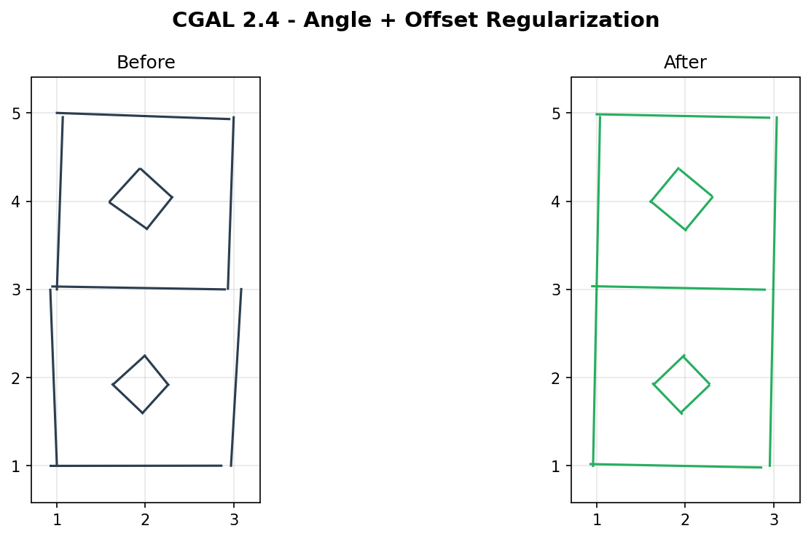

### Contour Regularization

Simplify complex polygons while preserving their essential shape:

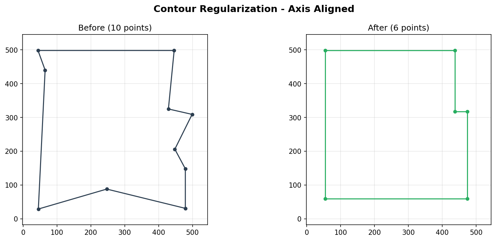

Complex shapes are reduced to their essential vertices:


### Snap Regularization

Snap regularization connects nearby endpoints to create watertight geometry. This is essential for creating closed polygons suitable for 3D extrusion, mesh generation, or CAD operations.

#### Cluster Method (Fastest)

The cluster method groups nearby endpoints and moves them to their centroid. This is the fastest approach and guarantees watertight results:

```python
from shreg import snap_regularize_segments, seg

segments = [
    seg(0.0, 0.0, 1.0, 0.05),
    seg(1.08, 0.0, 1.05, 1.0),
    seg(1.0, 1.08, 0.0, 0.95),
    seg(-0.05, 1.0, 0.0, 0.0),
]
result = snap_regularize_segments(segments, epsilon=0.15, method="cluster")
```

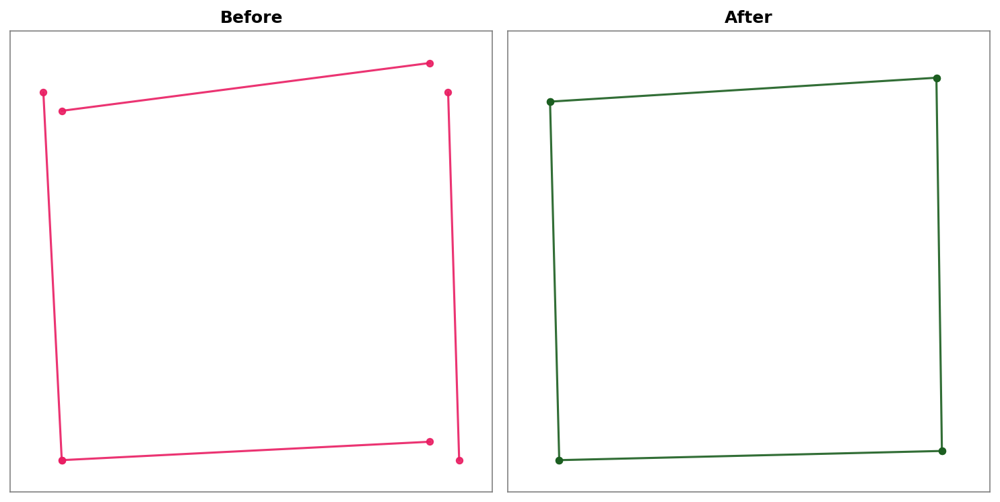

#### Hard Constraints (Exact)

Hard constraints use quadratic programming to find the optimal positions that exactly satisfy all snap constraints while minimizing total endpoint movement:

```python
result = snap_regularize_segments(segments, epsilon=0.15, method="hard")
```

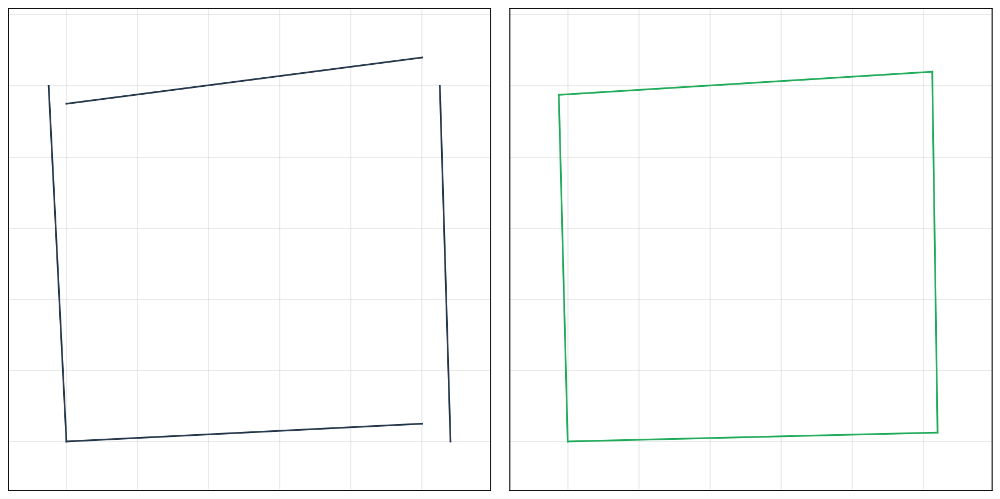

#### Soft Constraints (Elastic)

Soft constraints add "spring" forces between endpoints that should connect. This is useful when data is noisy and you're not certain endpoints should be exactly coincident:

```python
result = snap_regularize_segments(
    segments,
    epsilon=0.25,
    method="soft",
    soft_weight=50.0  # Higher = stiffer springs
)
```

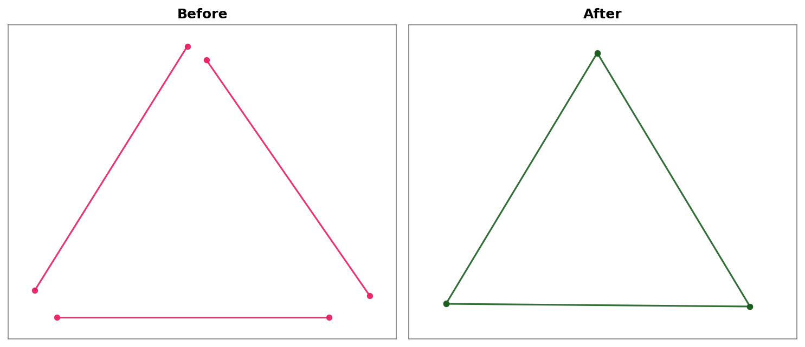

#### T-Junction Detection

T-junctions occur when an endpoint should snap onto another segment's interior (not its endpoints). Enable T-junction detection for proper connectivity:

```python
segments = [
    seg(0.0, 0.0, 2.0, 0.0),      # horizontal line
    seg(0.0, 1.0, 2.0, 1.0),      # horizontal line
    seg(0.95, -0.08, 1.05, 1.1),  # vertical line (forms T-junctions)
]
result = snap_regularize_segments(
    segments, epsilon=0.15, method="cluster", t_junctions=True
)
```

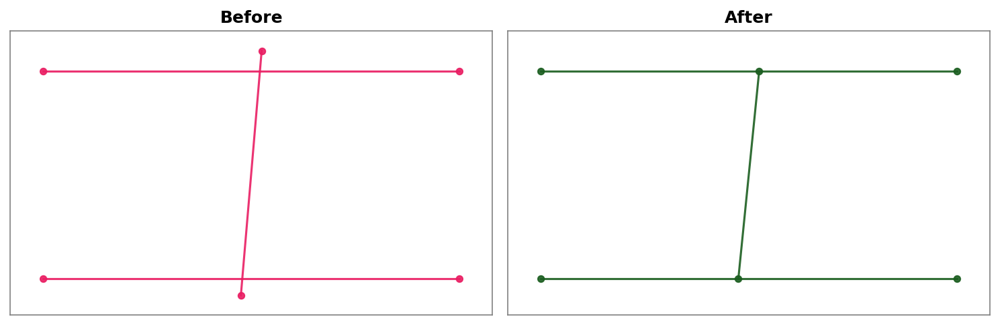

#### Complex Polygons

Snap regularization works on polygons of any complexity:

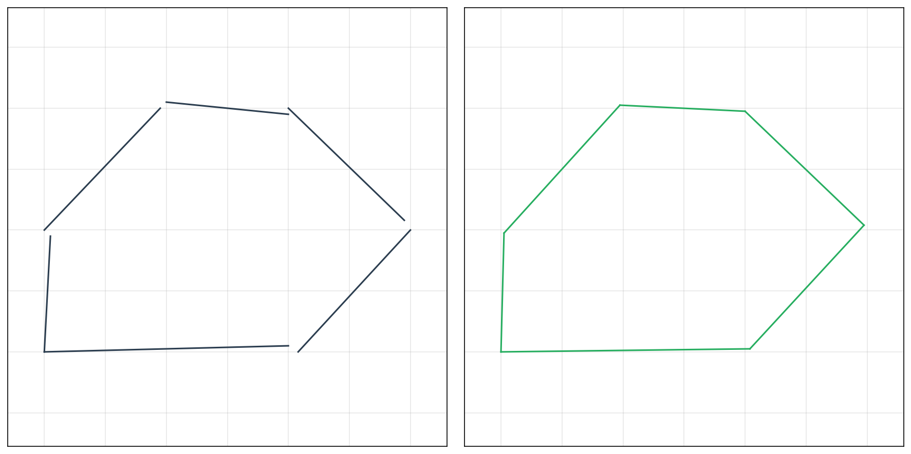

### Metric & Pattern Regularization

Metric regularization constrains the relative measurements of segments. This is useful for architectural drawings, CAD cleanup, and any domain where dimensions should follow regular patterns.

#### Equal Length

Forces segments with similar lengths to be exactly equal. Useful when objects (like windows or columns) should have identical dimensions:

```python
from shreg import metric_regularize_segments, seg

segments = [
    seg(0.0, 0.0, 2.0, 0.0),    # length 2.0
    seg(0.0, 1.0, 2.15, 1.0),   # length 2.15
    seg(0.0, 2.0, 1.9, 2.0),    # length 1.9
    seg(0.0, 3.0, 2.05, 3.0),   # length 2.05
]

result = metric_regularize_segments(
    segments,
    equal_length=True,
    length_tolerance=0.15,  # 15% relative tolerance
)
# Result: All segments now have equal length (~2.0)
```

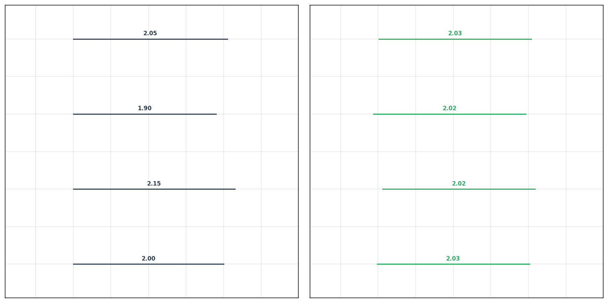

#### Length Quantization

Snaps segment lengths to integer multiples of a base unit. Essential for architectural plans where walls must be multiples of a grid unit:

```python
segments = [
    seg(0.0, 0.0, 1.85, 0.0),   # length 1.85 -> 2.0
    seg(0.0, 1.0, 3.15, 1.0),   # length 3.15 -> 3.0
    seg(0.0, 2.0, 0.9, 2.0),    # length 0.9 -> 1.0
    seg(0.0, 3.0, 2.2, 3.0),    # length 2.2 -> 2.0
]

result = metric_regularize_segments(
    segments,
    length_quantization=True,
    base_unit=1.0,              # Snap to 1-meter multiples
    quantization_tolerance=0.3, # Within 30% of base unit
)
```

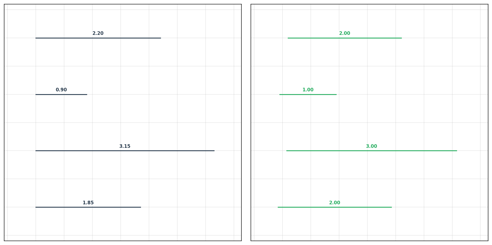

#### Equal Spacing

Forces equal gaps between parallel lines. Perfect for regularizing staircases, window arrays, or any repeated elements:

```python
segments = [
    seg(0.0, 0.0, 3.0, 0.0),    # y=0.0
    seg(0.0, 0.9, 3.0, 0.9),    # y=0.9 (uneven)
    seg(0.0, 2.0, 3.0, 2.0),    # y=2.0
    seg(0.0, 3.1, 3.0, 3.1),    # y=3.1 (uneven)
    seg(0.0, 4.0, 3.0, 4.0),    # y=4.0
]

result = metric_regularize_segments(
    segments,
    equal_spacing=True,
    angle_tolerance=5.0,  # Lines within 5° are considered parallel
)
# Result: Lines are now evenly spaced at y=0, 1, 2, 3, 4
```

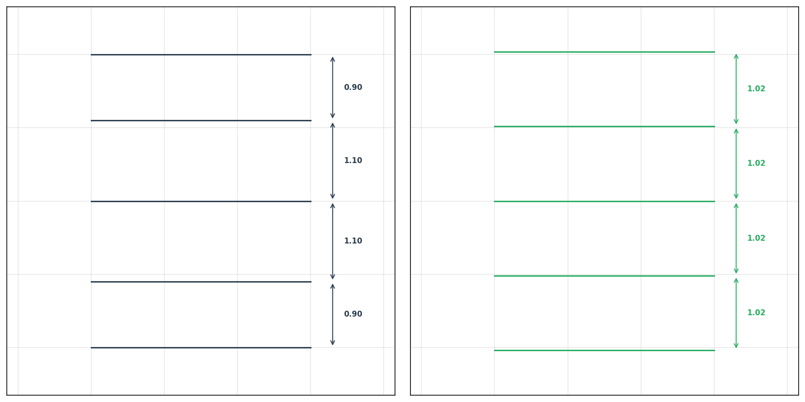

## API Reference

See [API.md](API.md) for the complete API documentation.

## Command Line Interface

Run the demo examples:

```bash
# Run all examples with visualization
shreg

# Run without visualization (batch mode)
shreg --no-plot

# Run only segment examples
shreg --segments

# Run only contour examples
shreg --contours
```

Or using Python module syntax:

```bash
python -m shreg --help
```

## Algorithm

### Energy Minimization via Quadratic Programming

The regularization problem is formulated as an **energy minimization** problem. Given a set of segments, we seek small adjustments (rotations and translations) that minimize an energy function while respecting constraints on maximum deviations.

The energy function balances two objectives:
- **Fidelity**: Keep segments close to their original positions
- **Regularity**: Encourage nearby segments to share common angles and offsets

This leads to a **quadratic program (QP)** of the form:

```
minimize    (1/2) x'Px + q'x
subject to  l <= Ax <= u
```

where `x` contains the rotation and translation corrections for each segment, `P` encodes the fidelity cost, and the constraints enforce that angle/offset differences between nearby segments are minimized.

### Segment Regularization Pipeline

1. **Neighbor Detection**: Use Delaunay triangulation on segment midpoints to identify nearby segment pairs efficiently
2. **Constraint Graph**: Build constraints for angle and offset differences between neighboring segments within tolerance bounds
3. **QP Optimization**: Solve the quadratic program using OSQP to find optimal corrections
4. **Application**: Apply computed rotations and translations to each segment

### Snap (Connectivity) Regularization

Snap regularization is formulated as a **Constrained Quadratic Programming** problem that minimizes endpoint movement while enforcing connectivity constraints.

**Variables:** For N segments, the state vector contains all 4N endpoint coordinates:
```
x = [x₁₁, y₁₁, x₁₂, y₁₂, ..., xₙ₂, yₙ₂]ᵀ
```

**Objective (Fidelity):** Minimize squared distance from original positions:
```
minimize (1/2) Σᵢ (||uᵢ - ûᵢ||² + ||vᵢ - v̂ᵢ||²)
```

**Methods:**

| Method | Formulation | Use Case |
|--------|-------------|----------|
| `cluster` | Replace clustered endpoints with centroid | Fast, guaranteed watertight |
| `hard` | Equality constraints: vᵢ - uⱼ = 0 | Exact connections required |
| `soft` | Penalty term: λ·Σ||vᵢ - uⱼ||² | Noisy data, uncertain connections |

**Pipeline:**
1. **Endpoint Detection**: Build KD-Tree on all 2N endpoints
2. **Clustering**: Use Union-Find to group endpoints within ε distance
3. **Variable Reduction** (cluster): Replace clusters with single variables
4. **QP Solve** (hard/soft): Optimize using OSQP
5. **T-Junction Handling**: Project endpoints onto target segments

### Metric & Pattern Regularization

Metric regularization constrains segment dimensions (length, distance). The challenge is that length calculation `√(Δx² + Δy²)` is **non-linear**, but QP solvers require linear constraints.

**Linearization:** We approximate length using the segment's unit direction vector **d** = (dₓ, dᵧ):

```
L ≈ dₓ(xₑ - xₛ) + dᵧ(yₑ - yₛ)
```

This is linear in the endpoint coordinates and can be directly inserted into the constraint matrix.

**Constraint Formulations:**

| Constraint | Mathematical Form | Application |
|------------|-------------------|-------------|
| Equal Length | L_A - L_B = 0 | Windows, columns |
| Quantization | L = K (target) | Grid snapping |
| Equal Spacing | 2·Pos(L₂) - Pos(L₁) - Pos(L₃) = 0 | Stairs, arrays |

**Iterative Refinement (SQP):** Because the unit vectors are computed from the *current* geometry, results are approximate if segments rotate significantly. The algorithm uses Sequential Quadratic Programming:

1. Compute unit vectors from current segment orientations
2. Build and solve the QP
3. Update segment coordinates
4. Repeat until convergence (or max iterations)

**Pipeline:**
1. **Detection**: Find candidate pairs/groups (similar lengths, parallel lines)
2. **Linearization**: Compute unit direction vectors for length approximation
3. **Constraint Building**: Build sparse constraint matrix A for detected patterns
4. **QP Solve**: Minimize ||x - x̂||² subject to Ax = b using OSQP
5. **Iteration**: Refine unit vectors and re-solve if needed

### Contour Regularization

The contour regularization algorithm follows CGAL's approach for closed polygons:

1. **Angle Alignment**: Rotate each edge to align with principal directions (modulo 90 degrees)
2. **Parallel Merging**: Merge consecutive parallel edges that are close together
3. **Link Insertion**: Insert connecting segments between remaining parallel edges
4. **Intersection**: Compute intersection points to form the final regularized polygon

## Dependencies

- `numpy >= 1.20.0`
- `scipy >= 1.7.0`
- `osqp >= 0.6.0`
- `matplotlib >= 3.5.0`

## Development

Install development dependencies:

```bash
pip install -e ".[dev]"
```

Run tests:

```bash
pytest tests/ -v
```

Run tests with coverage:

```bash
pytest tests/ -v --cov=shreg --cov-report=term-missing
```

## References

- Jean-Philippe Bauchet and Florent Lafarge. **KIPPI: KInetic Polygonal Partitioning of Images**. In *IEEE Conference on Computer Vision and Pattern Recognition (CVPR)*, pages 3146–3154, Salt Lake City, United States, June 2018. [[PDF](https://inria.hal.science/hal-01740958/document/)]
- [CGAL Shape Regularization Documentation](https://doc.cgal.org/latest/Shape_regularization/)
- [OSQP: Operator Splitting Quadratic Program Solver](https://osqp.org/)
